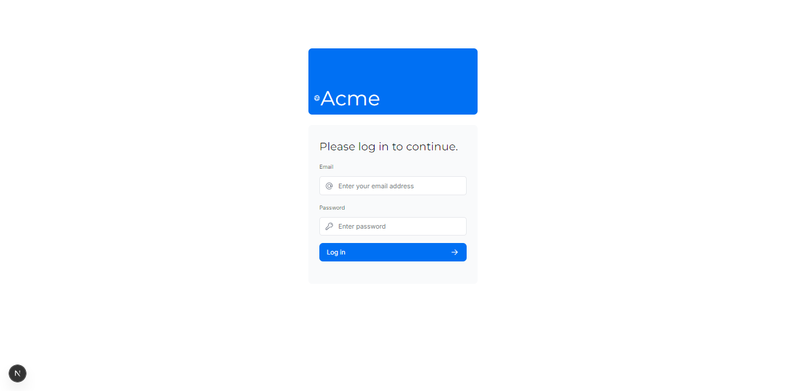
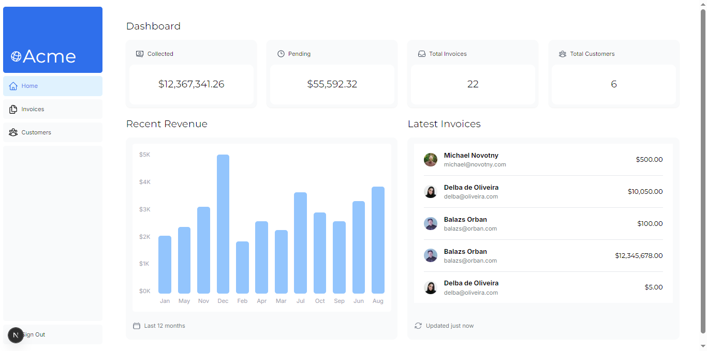
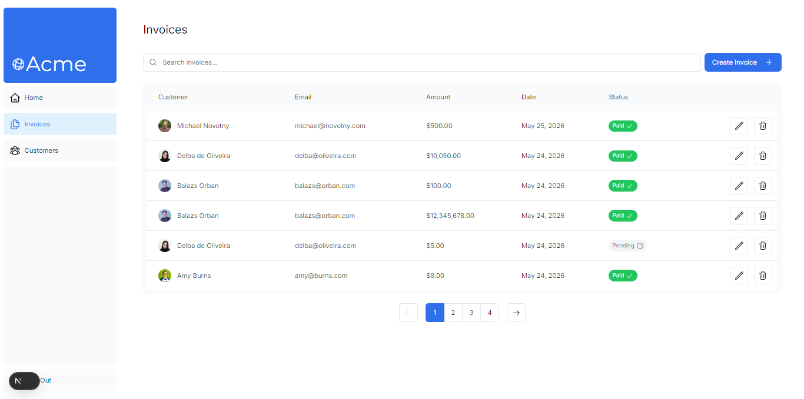
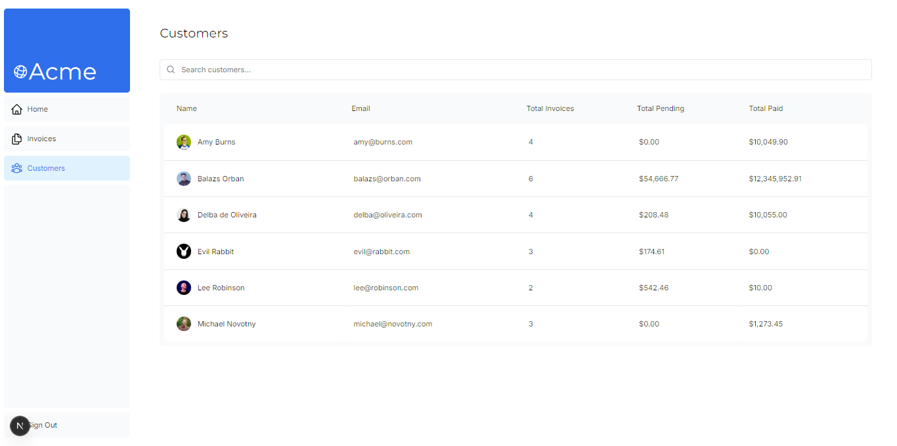

# 🚀 Next.js Dashboard App — Full-Stack

Este repositorio contiene el desarrollo completo de la aplicación de administración del curso oficial de **Next.js de Vercel**, enriquecido y potenciado con conceptos avanzados extraídos directamente de la documentación técnica y buenas prácticas de la comunidad (incluyendo el análisis del curso de Midudev).

El proyecto no solo cubre las bases esenciales de enrutamiento y renderizado, sino que profundiza en la gestión avanzada de estados en el servidor, mutaciones seguras y optimización extrema de la experiencia de usuario.

---

## 📸 Capturas

### Login

### Dashboard

### Invoices

### Customers

---

## 🛠️ Tecnologías Core

* **Framework:** Next.js (App Router)
* **Lenguaje:** TypeScript
* **Estilos:** Tailwind CSS & `clsx` (Diseño responsivo y utilitario)
* **Base de Datos:** PostgreSQL (vía `postgres` con SSL requerido)
* **Autenticación:** NextAuth.js (v15 Beta / Configuración desacoplada Edge/Node)
* **Validación de Esquemas:** Zod
* **Iconografía:** Heroicons & Lucide React (Custom spinners con animaciones nativas inline)

---

## 💡 Aprendizajes y Características Avanzadas

A diferencia del flujo básico de la guía inicial, este repositorio consolida extensiones técnicas basadas en la documentación oficial y optimizaciones críticas:

### 1. Arquitectura de Rutas y Renderizado
* **Estrategias de Renderizado Híbrido:** Implementación de Renderizado Estático Estricto (Static Rendering) para secciones públicas y **Renderizado Dinámico (Dynamic Rendering)** mediante la función `unstable_noStore` para asegurar datos en tiempo real.
* **Rutas Protegidas:** Configuración de Next.js Middleware para interceptar requests y evaluar sesiones antes de iniciar el ciclo de renderizado, mejorando drásticamente el rendimiento y la seguridad.

### 2. Gestión de Datos y Mutaciones
* **Server Actions Puros:** Migración completa de lógica hacia el servidor usando `'use server'`, securizando mutaciones directamente desde formularios HTML nativos.
* **Validación en Servidor:** Esquemas estrictos con **Zod** para tipar y limpiar los datos provenientes de `FormData` antes de interactuar con la base de datos.
* **Manejo de Estados con Hooks React de Vanguardia:** Integración de `useActionState` para interceptar respuestas del servidor, capturar errores de credenciales (`CredentialsSignin`) y controlar estados de carga dinámicos con `isPending`.

### 3. Optimización de UX & UI (Streaming & Layouts)
* **Streaming en Cascada:** Uso de `loading.tsx` a nivel de ruta y componentes `<Suspense>` granulares para envolver componentes asíncronos pesados (evitando bloqueos de renderizado en la carga inicial).
* **Custom Skeletons:** Diseño de layouts de carga idénticos a las tablas finales de `/invoices` y de la vista personalizada de `/customers`.
* **Búsqueda y Paginación Optimizada:** Implementación de filtros en tiempo real usando parámetros de URL (`URLSearchParams`), sincronizando el estado con `useDebounce` para mitigar lecturas excesivas a la base de datos.

### 4. Seguridad Avanzada y Parche de Entornos Edge
* **Desacoplamiento de Criptografía:** Separación estratégica entre `auth.config.ts` y `auth.ts` para posibilitar la ejecución de NextAuth sobre entornos Edge sin colisionar con dependencias nativas de Node.js como `bcrypt`.

---

## 📁 Secciones Implementadas

* **`/dashboard`**: Vista general con métricas agregadas (Invoices, Customers, Earnings) usando carga asíncrona paralela.
* **`/dashboard/invoices`**: Panel CRUD completo para facturas con búsqueda integrada, paginación dinámica y manejo de errores mediante `error.tsx` y `not-found.tsx`.
* **`/dashboard/customers`**: Sección extendida (fuera del roadmap inicial del video) adaptando la arquitectura de tablas y Skeletons personalizados.
* **`/login`**: Formulario de acceso robusto con feedback visual interactivo.
